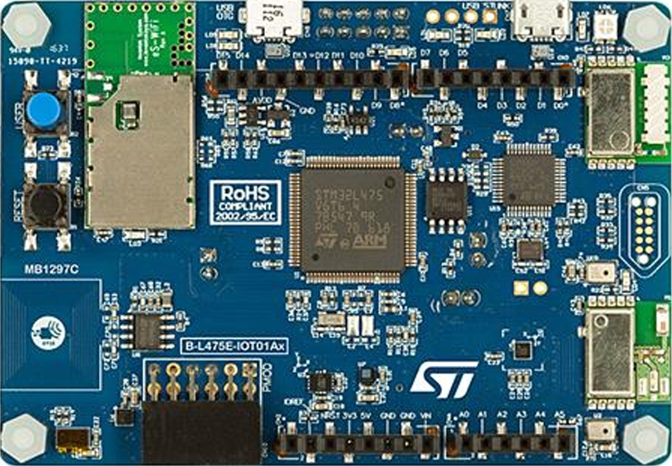

# YouLostIt PrivTag
A privacy preserving battery-powered lost-device tracker. 

## Overview  
**YouLostIt** is a privacy-enabled lost-item tracker designed to help users locate misplaced belongings. 
The device attaches to an item (e.g., a backpack) and uses an accelerometer to detect when it has remained 
stationary for an extended period, signaling that it is lost. It provides:  
- **Visual identification** via an LED indicator when in lost mode.  
- **Wireless alerts** using Bluetooth Low Energy (BLE) to notify nearby smartphones.  
- **Low-power operation** to maximize battery life.  

## Features  
- **Movement Detection**: Check the device movement every 10 seconds using an LSM6DSL accelerometer via I2C.  
- **Lost Mode Activation**: If stationary for over 1 minute, the device enters lost mode and activates visual and radio notifications.  
- **LED Indicator**: Lights up when in lost mode, providing a visual cue.  
- **BLE Notifications**: Sends messages to nearby smartphones when lost and disconnects when found.  
- **Low Power Design**: Utilizes STM32 Stop 2 mode to preserve energy, ensuring long battery life.  

## Technologies Used  
- **IDE**: STM32CubeIDE  
- **Microcontroller**: STMicroelectronics B-L475E-IOT01A1 Development Board  

- **Peripherals**:  
  - **GPIO**: LED control  
  - **Timer & LPTIM**: Accurate timing for lost mode detection  
  - **I2C**: Communication with accelerometer(LSM6DSL)
  - **SPI**: Bluetooth module (BlueNRG-MS)
  - **UART**: Debugging  
- **Low-Power Techniques**: Stop 2 mode, interrupt-based wake-ups 

## How It Works  
1. **Normal Mode**: The tracker monitors movement periodically.  
2. **Lost Mode Activation**: If no movement is detected for 1 minute, the LED turns on, and BLE advertisements begin.  
3. **Notification to Nearby Phones**: Nearby smartphones receive alerts via BLE.  
4. **Recovery**: When motion is detected again, the device exits lost mode, turning off the LED and stopping BLE notifications.  

## My Contributions & Learnings  

### Contributions  
- **Firmware Development**: Implemented low-level firmware drivers in C for STM32, including memory-mapped I/O for GPIO, Timers, I2C.  
- **Interrupt Handling**: Implemented efficient interrupt-based event handling for movement detection and timing control. 
- **Sensor Integration**: Wrote drivers for the LSM6DSL accelerometer to detect motion using I2C. 
- **BLE Communication**: Added BLE communication with the BlueNRG-MS module, enabling notifications to nearby smartphones.  
- **Low-Power Optimization**: Designed the system to stay in Stop 2 mode in most of the time, minimizing energy consumption while ensuring responsiveness. 

### What I Learned  
- **Embedded Firmware Development**: Gained hands-on experience with low-level C firmware programming for microcontrollers.  
- **Using Datasheets for Hardware Integration**: Learned how to implement device drivers by reading the datasheet specifications and setting register configurations. 
- **Peripheral Communication**: Learned how to interface with hardware components using I2C, SPI, and GPIO.  
- **Real-Time Event Handling**: Explored how to use interrupts and timers for precise control over device behavior. 
- **Low-Power Design Strategies**: Understood how to leverage STM32 low-power modes to extend battery life.  
- **Debugging Embedded Systems**: Improved skills in debugging embedded firmware using UART logging and logic analyzer(for I2C bus).  

## Design Notes
Here are the design notes for documenting how I built the YouLostIt project.  
- [GPIO and Timer Driver](design/GPIO-Timer.md)
- [I2C and LSM6DSL Driver](design/I2C-LSM6DSL.md)
- [BLE Integration](design/BLE.md)
- [Low Power Design](design/Low-Power.md)

## Code Sample  
- Code Sample is available upon request: [yuhenglin02042003@gmail.com](mailto:yuhenglin02042003@gmail.com)
